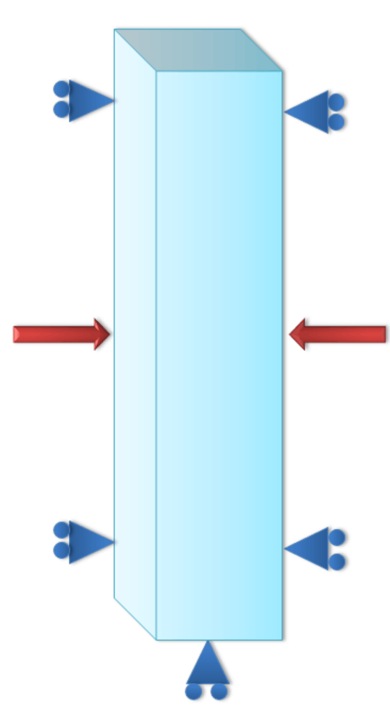
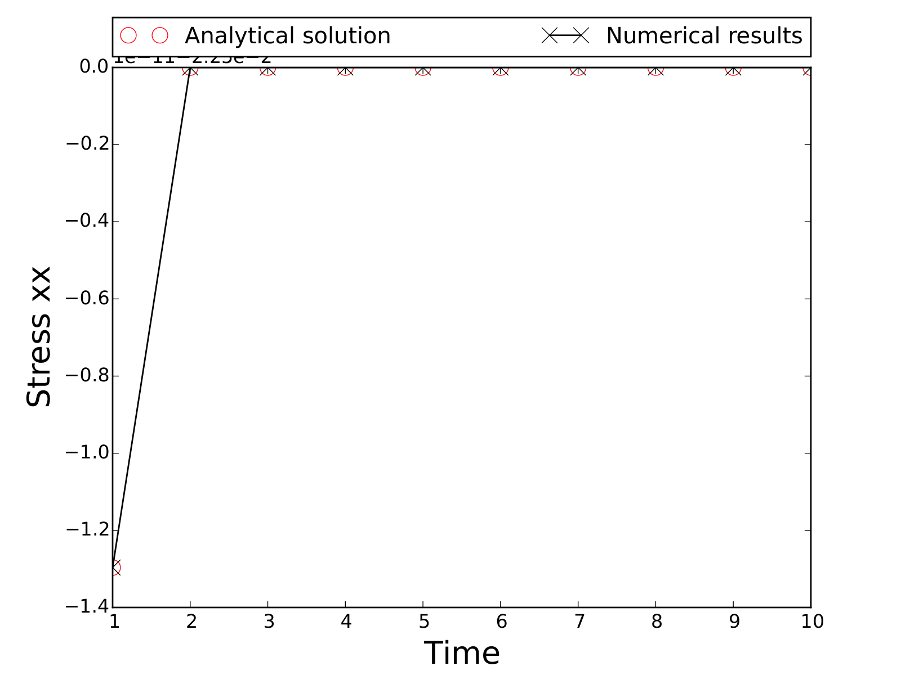
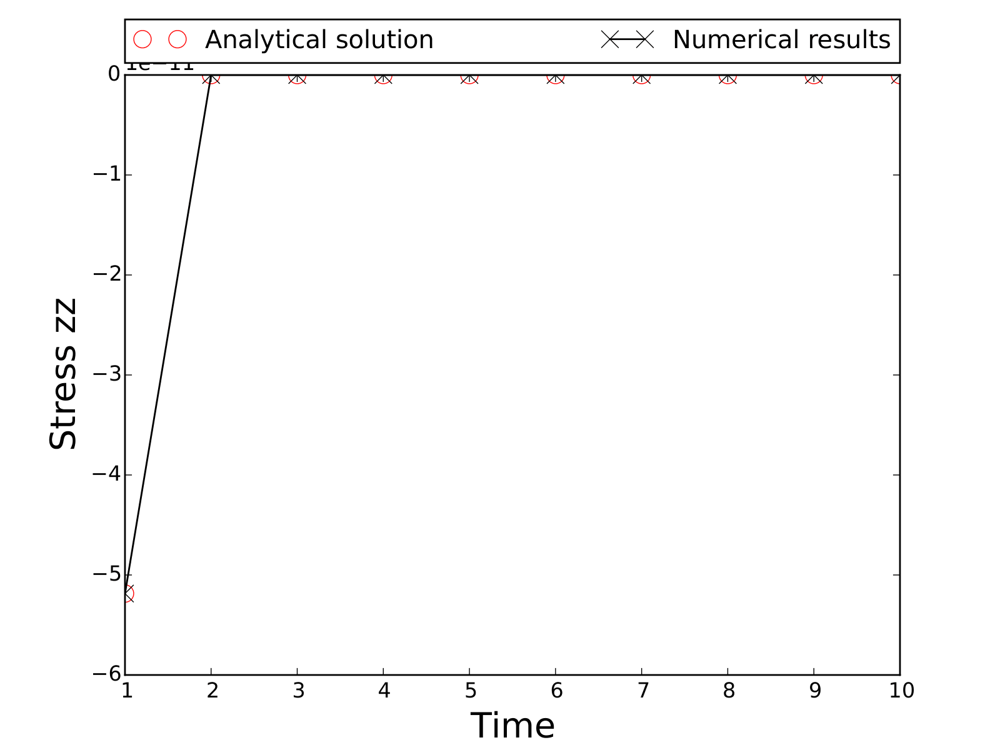

# Benchmark 6 - TM

This benchmark presents a simulation with a thermo-mechanical coupling.

## Problem Description

The problem considers an elastic rod that is heated from both top and bottom. The rod is mechanically confined on all sides except the front, as shown in Figure 1.

{ width="40%" }

***Figure 1:** Configuration of the elastic rod, confined from its sides and the bottom.*

## Analytical solution

The stress in the x-axis will be similar to the stress in the y-axis, whereas the stress in the z-axis will be zero since the rod is not confined in this direction. Because the temperature is increased, the rod will expand in the z-axis, resulting in a strain in the $zz$ direction. This strain is calculated by the following equation:

$$
\varepsilon_{zz}=\frac{\alpha}{2}\Delta T
$$

We divide $\alpha$ by $2$ because in this problem we have two dimensions (area thermal expansion coefficient). For more information, visit this website: [Thermal expansion](https://en.wikipedia.org/wiki/Thermal_expansion).

From this strain, we can calculate the stress in the x-axis, which is shown in the equation below:

$$
\sigma_{xx}=\frac{3}{2} \frac{E}{(1-2\nu)} \frac{\alpha}{2}\Delta T
$$

## Numerical solution

This problem is then solved using MOOSE on a generated 3D mesh. A comparison of the numerical results against the analytical solution is shown in the figures below.

{ width="40%" }

{ width="40%" }

***Figure 2:** The effect of thermal stress.*