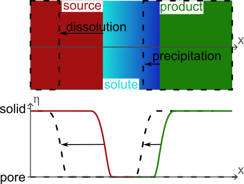
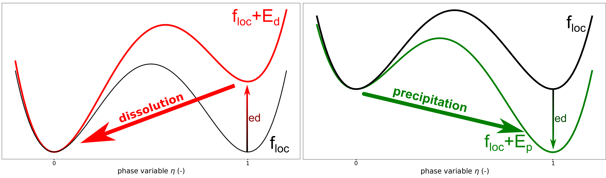
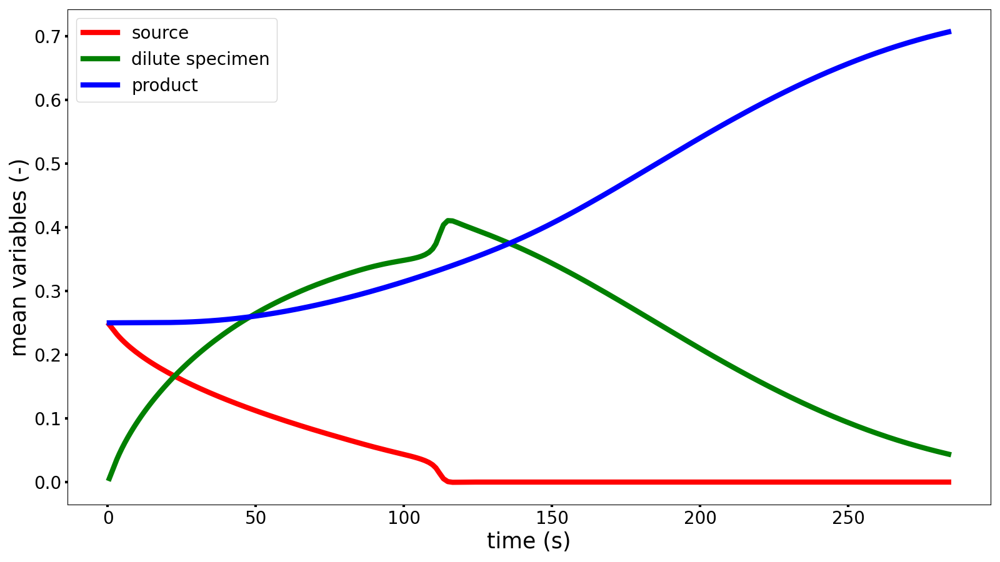

# Modelling a dissolution, diffusion, precipitation phenomenon with a Phase-Field approach

[Download the input file](./case3_dissolution_diffusion_precipitation.i)

## Problem description

Even if most of the materials appear homogeneous, they are heterogeneous at smaller scales.
For geomaterials, this smaller scale is at the level of the microstructure and it consists of grains (that can differ in minerals) and pores.
This microstructure is fundamental as the organization and the elements that compose it determine the multiphysical properties at the scale of the material.
Furthermore, this microstructure is affected by external solicitations and evolves with time.
Then, it becomes essential to predict the microstructure evolution.

Among the methods available in the literature, the phase-field approach emerges as an efficient and accurate tool for this prediction of the microstructure evolution due to multiphysical solicitations.


After the modelization of [homogeneous](../case1_homogeneous_dissolution/case1_homogeneous_dissolution.md) and [heterogeneous](../case2_heterogeneous_dissolution/case2_heterogeneous_dissolution.md) dissolution patterns, this new example illustrates a more complex evolution composed of dissolution, diffusion, and precipitation phenomena.
In particular, the system investigated considered a source solid that dissolves, generating some dilute specimens that diffuse and are consumed during the precipitation of a new solid, the product, see the illustration in [Figure 1](#fig-configuration).

<a id="fig-configuration"></a>



***Figure 1:** Definition of the configuration and description of the microstructure with a phase variable.*

The dissolution/precipitation of the solid phases (source and product) can be described by an Allen-Cahn equation, available in Eq. 1. 
This equation is applied to a phase variable $\eta \;(=\textit{source} \text{ or } \textit{product})$. 
This phase variable $\eta=1$ if the point corresponds to the given mineral, else it is equal to $0$, and the pore space is determined by $1-\textit{source}-\textit{product}$.

\[
    \frac{\partial\eta}{\partial t}=-L\,\frac{\partial\left(f_{loc}+E_d\right)}{\partial \eta} + L\cdot\kappa\,\nabla^2\eta
    \label{Equation Allen Cahn}
    \tag{1}
\]

In particular, this equation involves a free energy function $f_{loc}$ that describes the material and depends on the mineral. 
This free energy function is destabilized by a tilting energy function $E$, inducing the evolution of the microstructure, as depicted in [Figure 2](#fig_floc_ed) and formulated in Eq. 2.
This tilting energy depends on the chemical reaction expected (dissolution or precipitation). 
The additional parameters $L$ and $\kappa$ from Eq. 1 affect the interface width and the kinetics of the phenomenon.

\[
    f_{loc}+E(c) = W\times\left(\eta^2(1-\eta)^2\right) + ed(c)\times\left( 3\eta^2-2\eta^3\right)
    \label{Equation free energy}
    \tag{2}
\]

where $W$ is the barrier energy, preventing the phase transition, and $ed$ the tilting amplitude, inducing the phase transition. 

<a id="fig_floc_ed"></a>

{ width="60%" }

***Figure 2:** Destabilization of the free energy $f_{loc}$ by the tilting energy $E$ (for dissolution and precipitation).*

The amplitude of the tilting is dictated by the value of a new variable $c$ that describes the concentration of a reactive specimen in the pore fluid.
In the context of this model, the propagation of this solute is described by Eq. 3,

\[
    \frac{\partial c}{\partial t} = -\alpha_\textit{source} \frac{\partial \textit{source}}{\partial t} -\alpha_\textit{product} \frac{\partial \textit{product}}{\partial t} + \kappa_c \nabla^2 c
    \label{Equation Diffusion c}
    \tag{3}
\]

the terms $\frac{\partial c}{\partial t} = \kappa_c \nabla^2 c$ represent the diffusive propagation of the solute, and the terms $\alpha_\eta \frac{\partial \eta}{\partial t}$ ensure the conservation of the mass during the dissolution/precipitation of the solid.

Subsequently, by assuming the chemical reaction D $\left(\textit{source}_s \rightleftharpoons c_l\right)$ and P $\left(c_l \rightleftharpoons \textit{product}_s\right)$, the chemical quotient of the reactions are $Q_D=\frac{\{c\}}{\{\textit{source}\}}=c$ and $Q_P=\frac{\{\textit{product}\}}{\{c\}}=\frac{1}{c}$.
In the same note, the equilibrium constants are $K_D=c_{eq}^{\textit{source}}$ and $K_P=\frac{1}{c_{eq}^{\textit{product}}}$.
Comparing $Q$ with $K$, the dissolution occurs for $Q<K$ ($c<c_{eq}$) and the precipitation occurs for $Q>K$ ($c>c_{eq}$).
It is worth noting that the concentration of the solute at the equilibrium $c_{eq}^\eta$ can differ depending on the reaction (in the following $c_{eq}^\textit{source}=1$ and $c_{eq}^\textit{product}=0$).
Furthermore, the kinetics of the reaction depend on the distance to the equilibrium, see Eq. 4.

$$
\begin{align*}
    E_d &= \chi_\textit{source}\,(c_{eq}^\textit{source}-c)\times \left(3\textit{source}^2-2\textit{source}^3\right)\nonumber\\
    E_p &= \chi_\textit{product}\,(c_{eq}^\textit{product}-c)\times \left(3\textit{product}^2-2\textit{product}^3\right)
    \label{Equation E}
    \tag{4}
\end{align*}
$$

where $\chi_\eta$ is a constant relative to the global kinetics of the reaction.

---

## Model set up

As depicted in [Figure 1](#fig-configuration), the model simulates a heterogeneous grain dissolution due to the presence of a reactive specie. 
The *Phase-Field* module of MOOSE should be activated during the installation of REDBACK to solve this problem.

### Mesh

The first block called is the Mesh block.
For this example, the domain is a 2D square with a size of 1. 
Then, the domain is meshed with a regular grid, considering 100 elements in the X and Y directions.

In this example, the mesh is created by using a mesh generator from MOOSE. 
The quality of the simulation can be increased with an use of a more sophisticated mesh, involving refinement of the mesh close to the interface of the grain.
Such a mesh can be generated with external softwares.


```text
[Mesh]
    [mesh]
        type = GeneratedMesh
        dim = 2
        nx = 100
        ny = 100
        nz = 0
        xmin = 0
        xmax = 1
        ymin = 0
        ymax = 1
        elem_type = QUAD4
    []
[]
```

### Phase-field variable and initial condition

Once the mesh is generated, two phase variables ($\eta=$ *source* or *product*) are generated in the domain. These variables are equal to 1 if the point corresponds to the given mineral, else it is equal to 0. 
The pore space is determined with $1-(\textit{source}+\textit{product})$.
The interface between the solid and the pore phases is represented by $0<\eta<1$.

In this example, the initial condition of the variables are generated by a MOOSE function. 
More complex configurations can be investigated by employing the MOOSE functions that manage the initialization from .txt or .png files.

An additional variable $c$ is generated in the domain to represent the concentration of the reactive specimen. Its initial condition considers that the value is null.

```text
[Variables]
    [./source]
        order = FIRST
        family = LAGRANGE
        outputs = exodus
        [./InitialCondition]
            type = FunctionIC
            function = 'if(x<0.22, 1, if(x>0.28, 0, 0.5 +
                        0.5*cos(3.1415*(x-0.25+0.03)/0.06)))' 
                        # cosine profile
        [../]
    [../]
    [./product]
        order = FIRST
        family = LAGRANGE
        outputs = exodus
        [./InitialCondition]
            type = FunctionIC
            function = 'if(x>0.78, 1, if(x<0.72, 0, 0.5 + 
                        0.5*cos(3.1415*(0.75-x+0.03)/0.06)))'
                        # cosine profile
        [../]
    [../]
    [./c]
        outputs = exodus
        [./InitialCondition]
            type = ConstantIC
            value = 0
        [../]
    [../]
[]
```

### Kernels

Once the variables are defined, the system of partial derivative equations can be specified.
In this case, the system is divided into three equations: Eq. 1 applied on the variables *source* and *product*, and Eq. 3 applied on the variable $c$. 
For clarity reasons, the description of this system of equations is repeated in Eq. 5.

$$
\begin{align*}
    \frac{\partial\textit{source}}{\partial t}&=-L\,\frac{\partial\left(f_{loc}^\textit{source}+E_d\right)}{\partial \textit{source}} + L\cdot\kappa\,\nabla^2\textit{source} \nonumber\\
    \frac{\partial\textit{product}}{\partial t}&=-L\,\frac{\partial\left(f_{loc}^\textit{product}+E_p\right)}{\partial \eta} + L\cdot\kappa\,\nabla^2\textit{product}
    \label{Equation AC AC Dif}\tag{5}\\
    \frac{\partial c}{\partial t}&=-\alpha_\textit{source}\frac{\partial\textit{source}}{\partial t}-\alpha_\textit{product}\frac{\partial\textit{product}}{\partial t}+\kappa_c\nabla^2c \nonumber
\end{align*}
$$

As described in Eqs. 1 and 5, two Allen-Cahn equations, applied to the variables `source` and `product`, are solved to predict the dissolution/precipitation of the solid phases. 
This equation can be divided into three kernels:

* `TimeDerivative`: $\frac{\partial\eta}{\partial t}$
* `AllenCahn`: $-L\frac{\partial(f_{loc}+E)}{\partial\eta}$
* `ACInterface`: $L\kappa\nabla^2\eta$

It is worth noting that the same Allen-Cahn equation is applied to the variables *source* and *product*.
However, the parameters involved in these two equations differ. 
For example, the free energy functions $f_{loc}^{\eta}$ have the same form, but one depends on *source* and one depends on *product*. 
In the same note, the tilting energies differ: $E_d=\chi_c^\textit{source}\times\left(c_{eq}-c\right)\times\left(3\,\textit{source}^2-2\,\textit{source}^3\right)$ induces the dissolution of the source, while $E_p=-\chi_c^\textit{product}\times c\times\left(3\,\textit{product}^2-2\,\textit{product}^3\right)$ induces the precipitation of the product.
Even if differentiation could have been applied, $L$ and $\kappa$ are considered similar for the two phase variables.

In the same note, the diffusive equation applied to the variable `c`, described in Eqs. 3 and 5, is solved to predict the propagation of the concentration of the reactive specimen. 
This equation can be divided into three kernels:

* `TimeDerivative`: $\frac{\partial c}{\partial t}$
* `CoefCoupledTimeDerivative`: $\alpha_\eta\;\frac{\partial\eta}{\partial t}$. It is worth noting that this kernel uses the variable `eta` with the input `v` even if it is applied to the equation applied to the variable `c`
* `ACInterface`: $L_c\cdot \kappa_c \; \nabla^2 c$

It is essential to specify that the kernels are applied to the variables `eta` and `c`, which are defined in the `Variables` block.
In the same note, additional parameters are introduced `L_eta`, `g_eta`, `kappa_eta`, `kappa_c`, and `L_c`, defined in the block `Materials` (see below).

```text
[Kernels]
    # kernels on the phase variable source
    [./dsourcedt]
        type = TimeDerivative
        variable = source
    [../]
    [./ACBulk_source]
        type = AllenCahn
        variable = source
        coupled_variables = 'c' # add a dependence on the variable c
        mob_name = L_eta
        f_name = g_source
    [../]   
    [./ACInterface_source]
        type = ACInterface
        variable = source
        mob_name = L_eta
        kappa_name = kappa_eta
    [../]
    # kernels on the phase variable product
    [./dproductdt]
        type = TimeDerivative
        variable = product
    [../]
    [./ACBulk_product]
        type = AllenCahn
        variable = product
        coupled_variables = 'c' # add a dependence on the variable c
        mob_name = L_eta
        f_name = g_product
    [../]   
    [./ACInterface_product]
        type = ACInterface
        variable = product
        mob_name = L_eta
        kappa_name = kappa_eta
    [../]
    # kernels on the diffusive reactive specie c
    [./dcdt]
        type = TimeDerivative
        variable = c
    [../]
    [./source_c]
        type = CoefCoupledTimeDerivative
        variable = c
        v = 'source'
        coef = 2
    [../]
    [./product_c]
        type = CoefCoupledTimeDerivative
        variable = c
        v = 'product'
        coef = 1
    [../]
    [./c_diffusion]
        type = ACInterface
        variable = c
        kappa_name = kappa_c
        mob_name = L_c
    [../]
[]
```

### Materials

As introduced in the preceding `Kernels` block, the material properties must be assigned in the domain. Here, two types of properties are introduced: the homogeneous properties and the heterogeneous properties.
The function `GenericConstantMaterial` assigns a constant value to a property in the entire domain, while the functions `ParsedMaterial` and `DerivativeParsedMaterial` generate a heterogeneous field for the property.

Concerning these functions `ParsedMaterial` and `DerivativeParsedMaterial`, they are divided into several main inputs:

- `block`: the domain of application of this function, depending on the mesh generated in the block `Mesh`
- `property_name`: the name of the property, used for instance in the block `Kernels`
- `expression`: the expression of the free energy $f_{loc}+E_d$ of the material
- `coupled_variables`: the definition of the variables used in the `expression` of the free energy. These variables can be a material or a variable of the problem
- `constant_names`: the definition of the constants used in the `expression` of the free energy. The values of these constants are specified with `constant_expressions`
- `derivative_order`: (only for `DerivativeParsedMaterial`) the derivatives of this function (until this order) are automatically computed

It is worth noting that the diffusion coefficient depends on the variables $\eta$ to prevent the propagation of the reactive specimen $c$ in the solid phases.

```text
[Materials]
    [./consts]
        type = GenericConstantMaterial
        prop_names  = 'L_eta kappa_eta L_c'
        prop_values = '1 0.00037 1'
    [../]
    [./var]
        type = ParsedMaterial
        property_name = kappa_c
        coupled_variables = 'source product'
        constant_names = 'k_c_0'
        constant_expressions = '0.001'
        expression = 'k_c_0*(1-source)*(1-product)'
    [../]
    [./energy_source]
        type = DerivativeParsedMaterial
        property_name = g_source
        coupled_variables = 'source c'
        constant_names = 'W x_c'
        constant_expressions = '1 0.1'
        expression = 'W*(source^2)*((1-source)^2) +
                        x_c*(1-c)*(3*source^2-2*source^3)'
        enable_jit = true
        derivative_order = 1
    [../]
    [./energy_product]
        type = DerivativeParsedMaterial
        property_name = g_product
        coupled_variables = 'product c'
        constant_names = 'W x_c'
        constant_expressions = '1 0.3'
        expression = 'W*(product^2)*((1-product)^2) -
                        x_c*c*(3*product^2-2*product^3)'
        enable_jit = true
        derivative_order = 1
    [../]
[]
```

### Solver preconditioning and executioner

In order to prepare for the resolution of the problem, the block `Preconditioning` is called.

```text
[Preconditioning]
    [./SMP]
        type = SMP
        full = true
    [../]
[]
```

Then, the resolution of the problem is conducted with the block `Executioner`.
Herein, a `Transient` executioner is selected to determine the evolution with time of the solid phase.
In particular, the simulated time is determined by the stopping conditions (here `num_steps`), and the quality of the results depends on the tolerance applied to the residual (here `l_tol`, `l_abs_tol`, `nl_rel_tol`, `nl_abs_tol`).
Furthermore, an adaptive time step is employed with `SolutionTimeAdaptiveDT` to optimize the resolution of the problem.

```text
[Executioner]
    type = Transient
    scheme = 'bdf2'
    solve_type = 'NEWTON'
    l_max_its = 20
    l_tol = 1e-6
    l_abs_tol = 1e-6
    nl_max_its = 10
    nl_rel_tol = 1e-6
    nl_abs_tol = 1e-6
    start_time = 0.0
    num_steps = 200
    [./TimeStepper]
        type = SolutionTimeAdaptiveDT
        dt = 0.5
    [../]
[]
```

### Postprocessors

To help the visualization of the advancement of the simulation, the `Postprocessors` block is called. Here, a `ElementAverageValue` postprocessor is used to estimate the mean value of the variable `eta`, representing the quantity of solid in the domain.

```text
[Postprocessors]
    [source_pp]
        type = ElementAverageValue
        variable = source
    []
    [product_pp]
        type = ElementAverageValue
        variable = product
    []
    [c_pp]
        type = ElementAverageValue
        variable = c
    []
[]
```

### Outputs

Finally, the results of this simulation are managed with the block `Outputs`.
Different types of output are generated at the initial condition and at the each time step (see the command `execute_on`) :

- a .e file with the command `exodus` to obtain the field of the variable `eta`. This field can also be obtained with a `VTK` output to generate .vtk files which can be read by python scripts
- a `Console` output for the user to follow the simulation. This output is just for visualization and it is not saved
- a `CSV` output to generate a .csv file to obtain the evolution of a `Postprocessors` with time

```text
[Outputs]
    execute_on = 'initial timestep_end'
    exodus = true
    [console]
        type = Console
        execute_on = 'nonlinear'
        all_variable_norms = true
        max_rows = 5
    []
    [csv]
        type = CSV
        show = 'source_pp product_pp c_pp'
        execute_on = 'timestep_end'
    []
```

## Results

The first result is the movie showing the dissolution of the source, the diffusion of the dilute speciment, and the precipitation of the product.

<video controls width="700" src="Case3_DissolutionDiffusionPrecipitation.mp4"></video>

Then, the `CSV` output generates the time evolution of the mean value of the variables `source`, `product`, and `c`, depicted in [Figure 3](#fig-time-variables) and available from the generated .csv file.
As expected, the grain dissolves with time, generating dilute specimens that are consumed during the precipitation of the product.

<a id="fig-time-variables"></a>

{ width="80%" }

***Figure 3.** Time evolution of the mean variables.*

[Download the csv file](./case3_dissolution_diffusion_precipitation_csv.csv)

# References

1. N. Moelans, B. Blanpain, P. Wollants (2008), "An introduction to phase-field modeling of microstructure evolution", Computer Coupling of Phase Diagrams and Thermochemistry 32:268–294, DOI: 10.1016/j.calphad.2007.11.003
2. T. Takaki (2014), "Phase-field Modeling and Simulations of Dendrite Growth", ISIJ International 54:437–444, DOI: 10.2355/isijinternational.54.437
3. A. Sac-Morane, K. Ioannidou, M. Veveakis, H. Rattez (2026), "Predicting microstructure and mechanical properties during alite (C3S) hydration using a Phase-Field model", Construction and Building Materials 521:145946, DOI: 10.1016/j.conbuildmat.2026.145946