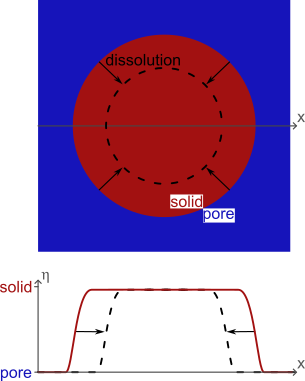
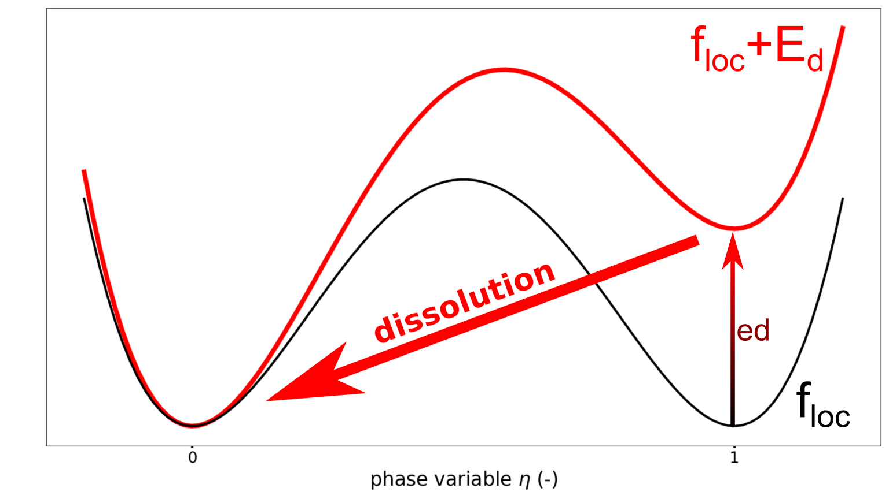
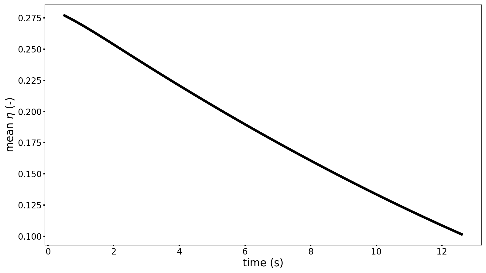

# Modelling a homogeneous shape evolution of a solid with a Phase-Field approach

## Problem description

Even if most of the materials appear homogeneous, they are heterogeneous at smaller scales.
For geomaterials, this smaller scale is at the level of the microstructure and it consists of grains (that can differ in minerals) and pores.
This microstructure is fundamental as the organization and the elements that compose it determine the multiphysical properties at the scale of the material.
Furthermore, this microstructure is affected by external solicitations and evolves with time.
Then, it becomes essential to predict the microstructure evolution.

Among the methods available in the literature, the phase-field approach emerges as an efficient and accurate tool for this prediction of the microstructure evolution due to multiphysical solicitations.

In particular, the microstructure can be described by a single phase variable $\eta$ ($=1$ in the solid phase, $=0$ in the pore phase), see the illustration in [Figure 1](#fig-configuration).

<a id="fig-configuration"></a>



***Figure 1:** Definition of the configuration and description of the microstructure with a phase variable.*

The Allen-Cahn equation, available in Eq. 1, is applied to solve the evolution of the microstructure.

\[
    \frac{\partial\eta}{\partial t}=-L\,\frac{\partial\left(f_{loc}+E_d\right)}{\partial \eta} + L\cdot\kappa\,\nabla^2\eta
    \label{Equation Allen Cahn}
    \tag{1}
\]

In particular, this equation involves a free energy function $f_{loc}$ that describes the material. 
This free energy function is destabilized by a tilting energy function $E_d$, inducing the evolution of the microstructure.
As depicted in [Figure 2](#fig_floc_ed) and formulated in Eq. 2,

\[
    f_{loc}+E_d = W\times\left(\eta^2(1-\eta)^2\right) + ed\times\left( 3\eta^2-2\eta^3\right)
    \label{Equation free energy}
    \tag{2}
\]

where $W$ is the barrier energy, preventing the phase transition, and $ed$ the tilting amplitude, inducing the phase transition.
The additional parameters $L$ and $\kappa$ from Eq. 1 affect the interface width and the kinetics of the phenomenon.

<a id="fig_floc_ed"></a>

{ width="60%" }

***Figure 2:** Destabilization of the free energy $f_{loc}$ by the tilting energy $E_d$.*

---

## Model set up

As depicted in [Figure 1](#fig-configuration), the model simulates a homogeneous grain dissolution. 
The *Phase-Field* module of MOOSE should be activated during the installation of REDBACK to solve this problem.

### Mesh

The first block called is the Mesh block.
For this example, the domain is a 2D square with a size of 1. 
Then, the domain is meshed with a regular grid, considering 100 elements in the X and Y directions.

In this example, the mesh is created by using a mesh generator from MOOSE. 
The quality of the simulation can be increased with an use of a more sophisticated mesh, involving refinement of the mesh close to the interface of the grain.
Such a mesh can be generated with external softwares.

```text
[Mesh]
    type = GeneratedMesh
    dim = 2
    nx = 100
    ny = 100
    nz = 0
    xmin = 0
    xmax = 1
    ymin = 0
    ymax = 1
    elem_type = QUAD4
[]
```

### Phase-field variable and initial condition

Once the mesh is generated, the variable $\eta$ is generated in the domain. This variable is equal to 1 to represent the solid phase and is equal to 0 to represent the pore phase. 
The interface between the solid and the pore phases is represented by $0<\eta<1$.

In this example, the initial condition of the variable (a circle) is generated by a MOOSE function. 
More complex configurations can be investigated by employing the MOOSE functions that manage the initialization from .txt or .png files.

```text
[Variables]
    [./eta]
        order = FIRST
        family = LAGRANGE
        outputs = exodus
        [./InitialCondition]
            type = SmoothCircleIC
            x1 = 0.5
            y1 = 0.5
            z1 = 0
            radius = 0.3
            invalue = 1
            outvalue = 0
            int_width = 0.06
        [../]
    [../]
[]
```

### Kernels

Once the variable is defined, the system of partial derivative equations can be specified.
As described in Eq. 1, an Allen-Cahn equation is solved to predict the dissolution of the solid phase. 
This equation can be divided into three kernels:

* `TimeDerivative`: $\frac{\partial\eta}{\partial t}$
* `AllenCahn`: $-L\frac{\partial(f_{loc}+E_d)}{\partial\eta}$
* `ACInterface`: $L\kappa\nabla^2\eta$

It is essential to specify that the kernels are applied to the variable `eta`, which is defined in the `Variables` block.
In the same note, additional parameters are introduced `L_eta`, `g_eta`, and `kappa_eta`, defined in the block `Materials` (see below).

```text
[Kernels]
    [./detadt]
        type = TimeDerivative
        variable = eta
    [../]
    [./ACBulk_eta]
        type = AllenCahn
        variable = eta
        mob_name = L_eta
        f_name = g_eta
    [../]
    [./ACInterface_eta]
        type = ACInterface
        variable = eta
        mob_name = L_eta
        kappa_name = kappa_eta
    [../]
[]
```

### Materials

As introduced in the preceding `Kernels` block, the material properties must be assigned in the domain. Here, two types of properties are introduced: the homogeneous properties and the heterogeneous properties.
The function `GenericConstantMaterial` assigns a constant value to a property in the entire domain, while the function `DerivativeParsedMaterial` generates a heterogeneous field for the property.
Concerning this function `DerivativeParsedMaterial`, it is divided into several main inputs:

- `block`: the domain of application of this function, depending on the mesh generated in the block `Mesh`
- `property_name`: the name of the property, used for instance in the block `Kernels`
- `expression`: the expression of the free energy $f_{loc}+E_d$ of the material
- `coupled_variables`: the definition of the variables used in the `expression` of the free energy. These variables can be a material or a variable of the problem
- `constant_names`: the definition of the constants used in the `expression` of the free energy. The values of these constants are specified with `constant_expressions`
- `derivative_order`: the derivatives of this function (until this order) are automatically computed

```text
[Materials]
    [./consts]
        type = GenericConstantMaterial
        prop_names  = 'L_eta kappa_eta'
        prop_values = '1 0.00037'
    [../]
    [./energy_eta]
        type = DerivativeParsedMaterial
        block = 0
        property_name = g_eta
        coupled_variables = 'eta'
        constant_names = 'W ed'
        constant_expressions = '1 0.1'
        expression = 'W*(eta^2)*((1-eta)^2) + ed*(3*eta^2-2*eta^3)'
        enable_jit = true
        derivative_order = 1
    [../]
[]
```

### Solver preconditioning and executioner

In order to prepare for the resolution of the problem, the block `Preconditioning` is called.

```text
[Preconditioning]
    [./SMP]
        type = SMP
        full = true
    [../]
[]
```

Then, the resolution of the problem is conducted with the block `Executioner`.
Herein, a `Transient` executioner is selected to determine the evolution with time of the solid phase.
In particular, the simulated time is determined by the stopping conditions (here `num_steps`), and the quality of the results depends on the tolerance applied to the residual (here `l_tol`, `l_abs_tol`, `nl_rel_tol`, `nl_abs_tol`).
Furthermore, an adaptive time step is employed with `SolutionTimeAdaptiveDT` to optimize the resolution of the problem.

```text
[Executioner]
    type = Transient
    scheme = 'bdf2'
    solve_type = 'NEWTON'
    l_max_its = 20
    l_tol = 1e-6
    l_abs_tol = 1e-6
    nl_max_its = 10
    nl_rel_tol = 1e-6
    nl_abs_tol = 1e-6
    start_time = 0.0
    num_steps = 50
    [./TimeStepper]
        type = SolutionTimeAdaptiveDT
        dt = 0.5
    [../]
[]
```

### Postprocessors

To help the visualization of the advancement of the simulation, the `Postprocessors` block is called. Here, a `ElementAverageValue` postprocessor is used to estimate the mean value of the variable `eta`, representing the quantity of solid in the domain.

```text
[Postprocessors]
    [eta_pp]
        type = ElementAverageValue
        variable = eta
    []
[]
```

### Outputs

Finally, the results of this simulation are managed with the block `Outputs`.
Different types of output are generated at the initial condition and at the each time step (see the command `execute_on`) :

- a .e file with the command `exodus` to obtain the field of the variable `eta`. This field can also be obtained with a `VTK` output to generate .vtk files which can be read by python scripts
- a `Console` output for the user to follow the simulation. This output is just for visualization and it is not saved
- a `CSV` output to generate a .csv file to obtain the evolution of a `Postprocessors` with time

```text
[Outputs]
    execute_on = 'initial timestep_end'
    exodus = true
    [console]
        type = Console
        execute_on = 'nonlinear'
        all_variable_norms = true
        max_rows = 5
    []
    [csv]
        type = CSV
        show = 'eta_pp'
        execute_on = 'timestep_end'
    []
```

## Results

The first result is the movie showing the dissolution of the solid phase.

<video controls width="700" src="../Case1_Dissolution.mp4"></video>

Then, the `CSV` output generates the time evolution of the mean value of the variable `eta`, depicted in [Figure 3](#fig-time-eta) and available from the generated .csv file.
As expected, the grain dissolves with time.

<a id="fig-time-eta"></a>

{ width="80%" }

***Figure 3.** Time evolution of the mean variable eta.*

# References

1. N. Moelans, B. Blanpain, P. Wollants (2008), "An introduction to phase-field modeling of microstructure evolution", Computer Coupling of Phase Diagrams and Thermochemistry 32:268–294, DOI: 10.1016/j.calphad.2007.11.003
2. T. Takaki (2014), "Phase-field Modeling and Simulations of Dendrite Growth", ISIJ International 54:437–444, DOI: 10.2355/isijinternational.54.437
3. A. Sac-Morane, K. Ioannidou, M. Veveakis, H. Rattez (2026), "Predicting microstructure and mechanical properties during alite (C3S) hydration using a Phase-Field model", Construction and Building Materials 521:145946, DOI: 10.1016/j.conbuildmat.2026.145946